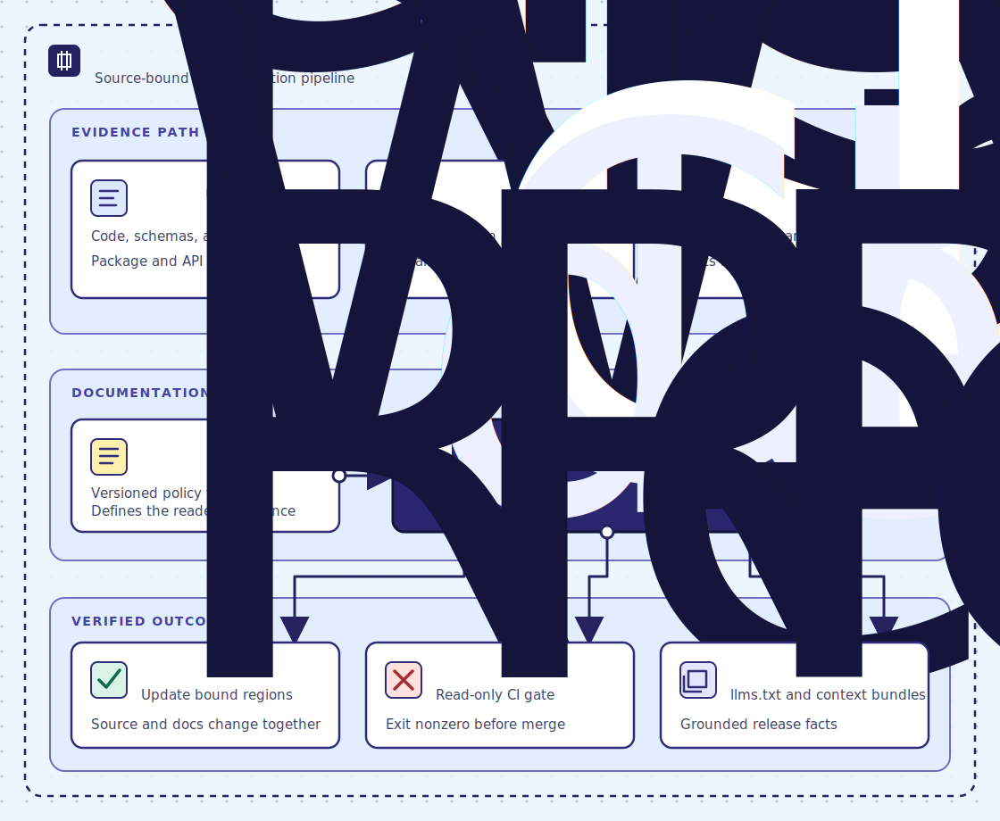

# clean-docs

<!-- clean-docs:policy register-v2 -->
<!-- clean-docs:purpose -->
clean-docs is a source-bound documentation engine and CLI for maintainers who need code and prose to change together. It turns selected source facts into checked documentation, so stale claims fail in local workflows and CI.
<!-- clean-docs:end purpose -->

[](https://github.com/owieschon/clean-docs/actions/workflows/ci.yml) [](https://github.com/owieschon/clean-docs/releases/latest) [](LICENSE)

**[Install clean-docs and catch your first stale claim](docs/learn/tutorial-catch-a-lying-doc.md)**.

The final `clean-docs verify` command prints a [`clean-docs.outcome.v1` receipt](docs/SUPPORT.md#record-local-outcomes) with `"ok": true`.

| If you need to... | Start with | You will leave with... |
| --- | --- | --- |
| Try the repair loop | [Runnable tutorial](docs/learn/tutorial-catch-a-lying-doc.md) | A failed drift check and a repaired page |
| Choose a command | [CLI reference](docs/CLI.md) | The command and its write boundary |
| Configure a binding | [Manifest reference](docs/REFERENCE.md) | A source-bound fact with the right depth |
| Understand trust boundaries | [Security model](docs/SECURITY_MODEL.md) | The process and host guarantees |

## Why clean-docs exists

<!-- clean-docs:begin product-overview -->
A stale sentence does not fail loudly. It keeps a straight face after the code has moved on, and reviewers have no mechanical way to identify the false claim. clean-docs gives each protected fact a source, then checks that relationship again in CI.

Source owns the facts. A packaged writing standard owns their form. Static adapters read common code and schema formats, while declared commands run under explicit process controls. The verified result can repair bound regions, reject drift, and publish context such as `llms.txt` with local receipts.
<!-- clean-docs:end product-overview -->

Human review can improve a sentence. It cannot make the sentence fail when its defining source changes. The [deterministic seam](docs/learn/deep-dive-the-deterministic-seam.md) explains how clean-docs separates source evidence, optional phrasing, and gate authority.

## Install and prove the loop

```bash
git clone https://github.com/owieschon/clean-docs.git && cd clean-docs
python3 -m venv .venv
source .venv/bin/activate
python3 -m pip install -e ".[dev]"
clean-docs audit
```

Protect a repository after the audit passes:

```bash
clean-docs init --no-model
git diff
clean-docs check
clean-docs verify
```

After a bound source changes, run `check`, then `drive`, then `project`, then `verify`. The [tutorial](docs/learn/tutorial-catch-a-lying-doc.md) shows the failure before the repair. The [support guide](docs/SUPPORT.md) covers release wheels and mature-repository adoption.

## How the pieces fit



Repository sources become typed evidence. Bindings assign that evidence to document regions, claims, and symbols. The engine applies the packaged standard, then repairs documentation, rejects drift, or publishes verified context. The [manifest page](docs/REFERENCE.md) lists each binding and projected output.

## Current boundaries

- Catalog coverage detects source additions, removals, and replacements. Protect a specific prose claim with a binding.
- `drive` repairs bound regions. Run `project` afterward when a projection includes the repaired document.
- Declared processes use time, I/O, and environment controls. The host owns network isolation; see the [security model](docs/SECURITY_MODEL.md).
- `audit`, `check`, `verify`, and `release` do not change documentation.
- Exit `1` means drift, exit `2` means invalid configuration, and exit `3` means extraction failed.

Use the [learning path](docs/learn/index.md) for the product map and evidence-backed examples. The [product contract](CLEAN_DOCS_SPEC.md) holds the complete behavior and version plan.
